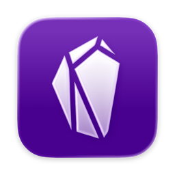
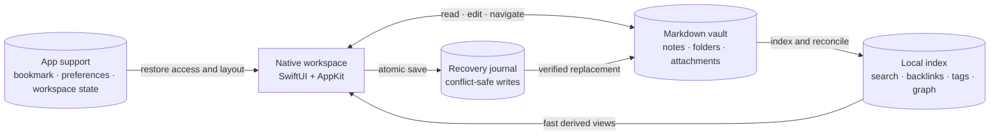

<div align="center">
  <h1><br>tg-sidian</h1>

  <p><strong>A fast, native macOS workspace for your Markdown vault.</strong></p>

  <p>
    <a href="https://github.com/thalysguimaraes/tg-sidian/actions/workflows/ci.yml"></a>
    
    
  </p>
</div>

tg-sidian is a privacy-first Markdown editor built in SwiftUI and AppKit. It works
directly with an existing folder-backed vault: no import, proprietary database,
account, or cloud service required.

> **Early release:** tg-sidian is under active development. Back up important vaults
> and review the [known scope](#current-scope) before making it your primary editor.

## How it works

The Markdown vault is always the source of truth. tg-sidian receives sandboxed access
only to a folder you choose, reads and writes the files in place, and stores its own
rebuildable or machine-specific state outside that folder.



Opening a vault starts a filesystem scan and builds a local SQLite/FTS5 index. Search,
backlinks, tags, and graph views read from that derived index; deleting it never
deletes or changes a note because it can be regenerated from Markdown.

Edits stay canonical Markdown. Saves use atomic replacement and compare the file
revision first, while a recovery journal protects pending work from interrupted
writes. If another app changes an open note, tg-sidian reloads a clean buffer or asks
you to resolve the conflict instead of silently overwriting either version.

Security-scoped bookmarks let macOS restore access to previously selected vaults.
Application Support holds only machine-local preferences and workspace state—not
vault content. Optional add-ons integrate through the neutral `ExtensionSDK`; they
remain outside the core editor and receive only explicitly declared capabilities.

The package follows the same boundaries:

| Module | Responsibility |
| --- | --- |
| `AppCore` | Shared models, preferences, protocols, and recovery contracts |
| `MarkdownKit` | Front matter, headings, tags, tasks, and wiki-link parsing |
| `VaultKit` | Contained filesystem access, atomic writes, moves, and daily notes |
| `IndexKit` | GRDB-backed SQLite/FTS5 indexing and filesystem reconciliation |
| `GraphKit` | Bounded graph extraction and deterministic layout |
| `SecurityKit` | Sandbox bookmark persistence |
| `FeatureUI` | Native workspace, editor, settings, backlinks, and graph |
| `ExtensionSDK` | Neutral host interfaces for separately maintained add-ons |

The only runtime dependency is
[GRDB.swift 7.11.1](https://github.com/groue/GRDB.swift/releases/tag/v7.11.1),
pinned exactly for reproducible index behavior.

## Requirements

- macOS 14 Sonoma or newer
- Xcode 26.6 / Swift 6.2 to build from source

## Build from source

Clone the repository and run:

```bash
swift test
xcodebuild \
  -project TGSidian.xcodeproj \
  -scheme TGSidian \
  -configuration Debug \
  build \
  CODE_SIGNING_ALLOWED=NO
```

To create an ad-hoc signed app you can open locally:

```bash
Scripts/build-local-app.sh
open .artifacts/tg-sidian.app
```

Pass an output path and `release` for an optimized bundle:

```bash
Scripts/build-local-app.sh .artifacts/tg-sidian-release.app release
```

The checked-in `TGSidian.xcodeproj` is ready to open directly. `project.yml` is its
XcodeGen source of truth; XcodeGen is only needed when changing the target structure.

## Current scope

The first public release focuses on the core local-vault workflow: choosing and
restoring a vault, browsing and editing Markdown, search, daily notes, backlinks,
tags, templates, and a local graph.

Dynamic plugin discovery, third-party extension distribution, mobile clients,
collaboration, sync, and hosted AI services are not part of the initial release.
The extension SDK is included as an architectural boundary; personal integrations
are intentionally not part of the public repository or app.

## Contributing

Issues and focused pull requests are welcome. Start with
[CONTRIBUTING.md](CONTRIBUTING.md) for the local workflow and architecture rules.
For security concerns, follow the private reporting guidance in
[SECURITY.md](SECURITY.md).

Useful design and implementation context lives in [`docs/adr`](docs/adr) and the
release checklist is tracked in
[`docs/OPEN_SOURCE_LAUNCH.md`](docs/OPEN_SOURCE_LAUNCH.md).

## License

tg-sidian is available under the [MIT License](LICENSE).
